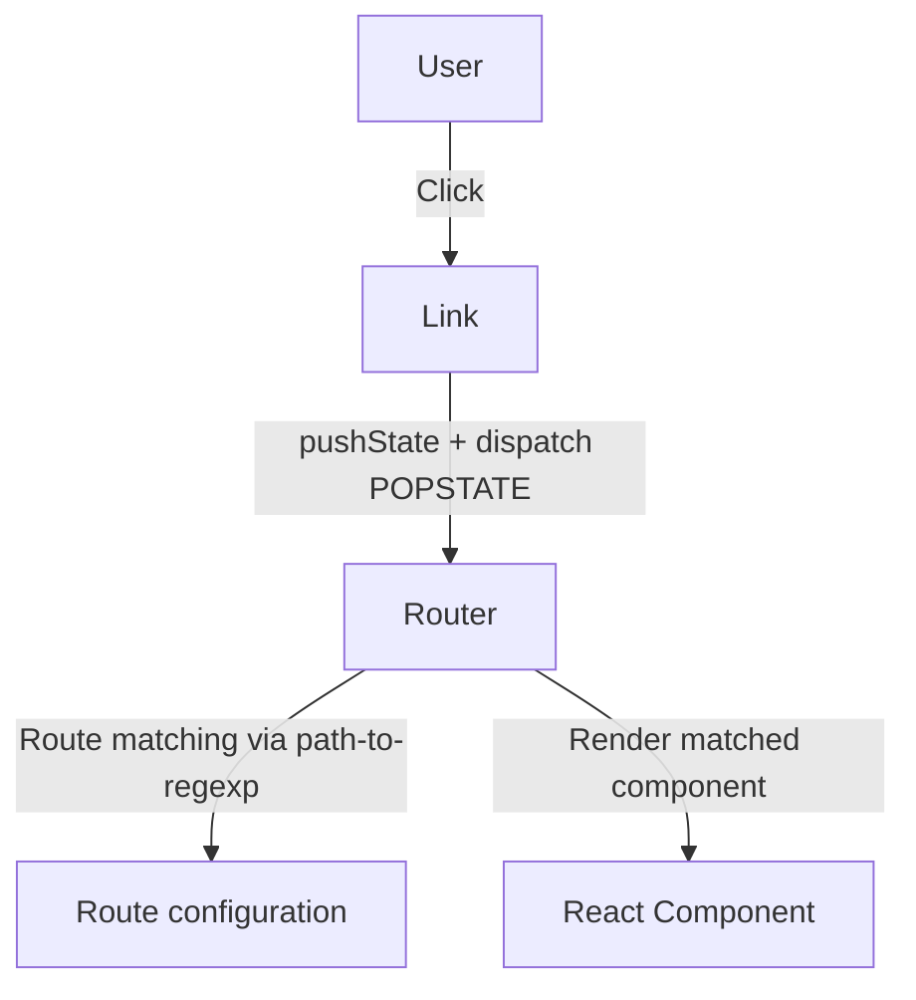

# 🛣️ alejhern_router – Custom React Router Library

## 📌 Purpose and Scope

`alejhern_router` is a **lightweight, client-side routing library for React**. It provides declarative routing components (`Router`, `Route`, `Link`) that integrate with the browser’s **History API** and use **path-to-regexp** for URL pattern matching.

Key features:

* Declarative routing via JSX or props
* Browser integration using History API and POPSTATE events
* Dynamic route parameter extraction (`/users/:id`)
* Minimal API surface (`Router`, `Route`, `Link`)
* Self-contained state management using `useState`

> 🔎 For usage examples, see the demo app included in the package (`index.html`).

---

## 🏗 Library Architecture

The library implements a **hook-driven, lightweight routing solution** for React.

### Component Interaction



### Core Design Principles

| Principle           | Implementation                               |
| ------------------- | -------------------------------------------- |
| Declarative Routing | Routes via `<Route>` children or props array |
| Browser Integration | History API + POPSTATE events                |
| Pattern Matching    | Uses path-to-regexp with params              |
| No External State   | State managed internally (`useState`)        |
| Minimal API         | Only Router, Route, Link                     |

---

## 🧩 Core Components

### Router

* Main orchestrator that manages route matching and rendering
* Registers **POPSTATE listener** to react to navigation events
* Accepts routes via:

  * Props-based: Array of `{ path, Component }`
  * JSX-based: `<Route>` children

**Route Matching Algorithm:**

```javascript
const routeMatcher = match(path, { decode: decodeURIComponent });
const matched = routeMatcher(currentPage);
if (!matched) return false;
Object.assign(routerParams, matched.params);
```

### Route

* Declarative marker component, returns `null`
* Provides route configuration to parent `Router`

**Props:**

```ts
{
  path: string,        // e.g., "/users/:id"
  Component: React.Component
}
```

### Link

* Client-side navigation without full page reload
* Intercepts click events and uses **History API**
* Fires POPSTATE to notify `Router`

**Props:**

| Prop     | Type   | Description                 |
| -------- | ------ | --------------------------- |
| to       | string | Target URL path             |
| target   | string | Link target, e.g., `_blank` |
| ...props | any    | Additional props for `<a>`  |

**Navigation Flow (Mermaid)**

```mermaid
sequenceDiagram
    participant User
    participant Link
    participant Router
    participant Component

    User->>Link: Click
    Link->>Router: pushState() + dispatch POPSTATE
    Router->>Router: Match route with path-to-regexp
    Router->>Component: Render matched component
```

---

## 🌐 Utilities & Constants

* **getCurrentPath** → Retrieves current browser pathname (used to initialize Router state)
* **EVENTS** → Defines `EVENTS.POPSTATE` for navigation handling

---

## 📦 Package Structure & Build Pipeline

### Build Pipeline

* Multi-stage build using **SWC**:

  1. Remove previous build: `rm -rf lib`
  2. Compile `src/components`, `src/utils`, `src/index.jsx` → `lib/`
  3. Minified ES2020 output, automatic JSX runtime

### Package Metadata

| Field   | Value            | Purpose                |
| ------- | ---------------- | ---------------------- |
| name    | alejhern_router | NPM package identifier |
| version | 0.0.3            | Semantic versioning    |
| private | false            | Public package         |
| type    | module           | ES modules             |
| main    | lib/src/index.js | Entry point            |
| files   | ["lib"]          | Distribution files     |

### SWC Compilation (`.swcrc`)

| Configuration               | Value      | Effect                |
| --------------------------- | ---------- | --------------------- |
| jsc.parser.syntax           | ecmascript | Parse JS with JSX     |
| jsc.parser.jsx              | true       | Enable JSX parsing    |
| jsc.transform.react.runtime | automatic  | Automatic JSX runtime |
| jsc.target                  | es2020     | Output target ES2020  |
| minify                      | true       | Minify output         |

---

## 🧪 Testing Infrastructure

* Test suite uses **Vitest** + **React Testing Library** (`src/Router.test.jsx`)

**Test Coverage:**

| Test Case               | Scenario                                      |
| ----------------------- | --------------------------------------------- |
| Default route rendering | Renders home page `/`                         |
| Static route matching   | Renders `/about` and `/contact`               |
| 404 handling            | Renders DefaultComponent for unknown routes   |
| Dynamic route params    | Extracts `:query` param from `/search/:query` |
| Link navigation         | Link triggers route change                    |

**Test Commands:**

* `npm run test` → Vitest watch mode
* `npm run test-ui` → Vitest UI for interactive testing

**Dependencies:** `vitest@^4.0.18`, `@vitest/ui@^4.0.18`, `happy-dom@^20.4.0`

---

## 🛠 Development Setup

| Script  | Command                   | Purpose                        |
| ------- | ------------------------- | ------------------------------ |
| dev     | vite                      | Start development server       |
| build   | vite build                | Build demo application         |
| lint    | eslint .                  | Lint source code               |
| preview | vite preview              | Preview production build       |
| test    | vitest                    | Run test suite                 |
| test-ui | vitest --ui               | Run tests interactively        |
| prepare | rm -rf lib && swc src/... | Build package for distribution |

* Demo app HTML entry: `index.html` → loads `/src/main`
* Styling for demo: `simple.css`

---

## ⚡ ESLint Configuration

* Flat config with React-specific plugins
* Rules:

  * React Hooks via `eslint-plugin-react-hooks`
  * React Refresh via `eslint-plugin-react-refresh`
  * Custom: `no-unused-vars` ignores uppercase/underscore variables

---

## 📂 File Structure (Key Directories)

```
projects/06_alejhern_router/
 ├─ src/
 │   ├─ components/  # Router, Route, Link
 │   ├─ utils/       # getCurrentPath, constants
 │   ├─ index.jsx    # Package entry
 │   └─ Router.test.jsx
 ├─ lib/             # Compiled distribution
 ├─ index.html       # Demo app entry
 └─ simple.css       # Demo styling
```

---

## 🔄 Complete Router Flow (Mermaid)

```mermaid
sequenceDiagram
    participant User
    participant Link
    participant Router
    participant Route
    participant Component

    User->>Link: Click "Go to /about"
    Link->>Router: pushState('/about') + dispatch POPSTATE
    Router->>Router: getCurrentPath()
    Router->>Route: Iterate over routes
    Route->>Router: Match path using path-to-regexp
    Router->>Component: Render matched Component
    Router->>User: Update DOM without reload
```

* **Explanation:**

  1. User clicks `<Link>`
  2. Link updates browser history and dispatches `POPSTATE`
  3. Router reads current path via `getCurrentPath`
  4. Routes are iterated and matched with path-to-regexp
  5. Router renders matched `Component`
  6. DOM updates dynamically without page reload