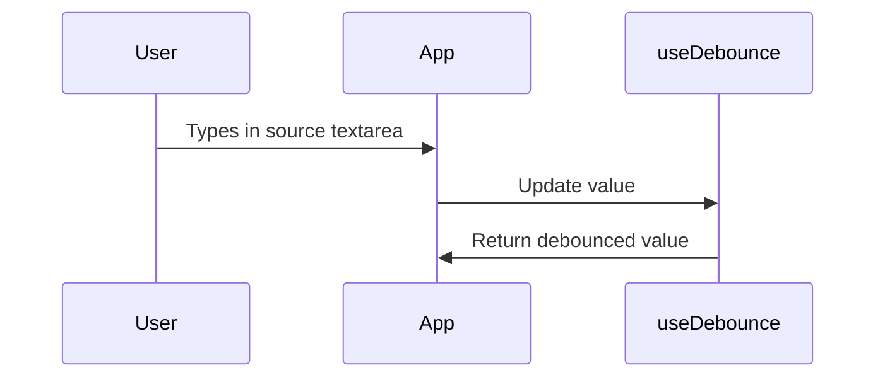
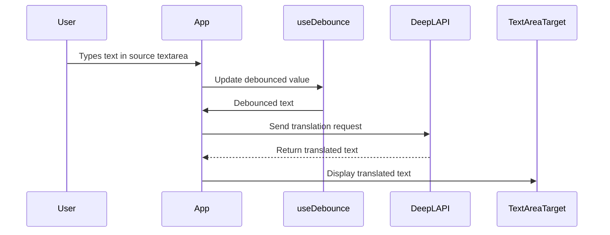

# 🌐 Translation Clone Application

## 📌 Purpose and Scope

The **Translation Clone Application** replicates core Google Translate functionality. It demonstrates:

* **Debounced input handling** for performance optimization
* **Multiple API integrations** (DeepL, OpenAI)
* **Reducer-based state management** (`useStore` hook)
* **Browser APIs**: SpeechSynthesis, Clipboard API
* **Two-panel interface**: source and target text areas
* Automatic language detection

> 🔎 For related learning projects:
>
> * Custom routing: see [alejhern__router](../06_alejhern_router)
> * Redux-like state patterns: see CRUD Redux Application

---

## 🏗 Application Architecture

### Component Hierarchy

```
App
 ├─ LangSelector (source / target)
 ├─ TextArea (source)
 ├─ Swap Button
 └─ TextArea (target)
```

* `App.tsx` orchestrates all child components and manages state
* `useStore` hook manages translation state with reducer + `shouldTranslate` flag

---

## 🧠 State Management with `useStore` Hook

The `useStore` hook uses `useReducer` for main translation state and a local flag `shouldTranslate` to control API calls.

| State Property  | Type    | Description                      |
| --------------- | ------- | -------------------------------- |
| sourceLanguage  | string  | Source language code or `'auto'` |
| targetLanguage  | string  | Target language code             |
| textToTranslate | string  | User input text                  |
| translatedText  | string  | API-translated text              |
| loading         | boolean | Translation in progress          |

### Actions Handled by Reducer

| Action                  | Behavior                                                                      |
| ----------------------- | ----------------------------------------------------------------------------- |
| `SET_SOURCE_LANGUAGE`   | Updates source language; sets `loading` if text exists                        |
| `SET_TARGET_LANGUAGE`   | Updates target language; sets `loading` if text exists                        |
| `SET_TEXT_TO_TRANSLATE` | Updates input text; sets `loading` true                                       |
| `SET_TRANSLATED_TEXT`   | Updates translated text; sets `loading` false                                 |
| `SWAP_LANGUAGES`        | Exchanges source & target languages and texts; prevents redundant translation |

### Action Dispatchers

| Method                        | Dispatched Action       | shouldTranslate | Purpose                                        |
| ----------------------------- | ----------------------- | --------------- | ---------------------------------------------- |
| `setSourceLanguage(language)` | `SET_SOURCE_LANGUAGE`   | true            | User selects source language                   |
| `setTargetLanguage(language)` | `SET_TARGET_LANGUAGE`   | true            | User selects target language                   |
| `setTextToTranslate(text)`    | `SET_TEXT_TO_TRANSLATE` | true            | User types text                                |
| `setTranslatedText(text)`     | `SET_TRANSLATED_TEXT`   | N/A             | API response received                          |
| `swapLanguages()`             | `SWAP_LANGUAGES`        | false           | Swap languages without triggering new API call |

---

## ⏱ Debouncing with `useDebounce` Hook

**Purpose:** Reduce frequency of API calls during rapid typing.

**Usage in App:**

```ts
const debouncedTextToTranslate = useDebounce(textToTranslate, 500);
```

**Flow:**



---

## 🌐 Translation API Integration

The application supports **DeepL** and **OpenAI**. Both are abstracted in a `translate()` service.

### 1️⃣ DeepL API

**Flow:**



**Implementation Notes:**

* `translate(text, sourceLanguage, targetLanguage)` in `services/translate_with_deepl.ts`
* Uses `fetch` to DeepL API endpoint with `Authorization: DeepL-Auth-Key`
* Auto-detection supported (`sourceLanguage='auto'`)
* Errors return fallback `'Error translating text'`

---

### 2️⃣ OpenAI API

**Flow:**


**Implementation Notes:**

* `translate(text, sourceLanguage, targetLanguage)` in `services/translate_with_openai.ts`
* Sends `POST` request to `https://api.openai.com/v1/chat/completions`
* Uses `model: "gpt-4"` and a translation prompt
* Errors return fallback `'Error translating text'`
* Supports context-aware and idiomatic translations

**Switching APIs:** Simply import the desired service in `App.tsx`:

```ts
import { translate } from './services/translate_with_deepl';
// OR
import { translate } from './services/translate_with_openai';
```

---

## 🖥 User Interface Components

### LangSelector Component

* Dropdown for selecting **source** or **target** language
* SOURCE selector supports `"Auto Detect"`
* Props: `type`, `onChange(language)`

### TextArea Component

* **SOURCE TextArea**: Editable, clipboard paste supported
* **TARGET TextArea**: Read-only, shows loading, supports text-to-speech & clipboard copy
* Props: `type`, `lang`, `value`, `onChange`, `placeholder`, `loading?`

### Swap Button

* Exchanges source and target languages and texts

### Layout

* Built with **react-bootstrap**
* Responsive grid:

  * `xs`: single column
  * `md`: source-button-target layout
  * `lg/xl`: centered, constrained layout

---

## 🎨 Styling

* Global dark/light theme via CSS color-scheme media queries
* Dark mode default: `#242424`
* Light mode via media query: white background
* App-specific styles in `App.css` (centered layout, padding)

---

## 🚀 Development Setup

### Scripts

| Command           | Purpose                  |
| ----------------- | ------------------------ |
| `npm run dev`     | Start React dev server   |
| `npm run build`   | Production build         |
| `npm run lint`    | Run ESLint               |
| `npm run preview` | Preview production build |
| `npm run test`    | Run test suite           |

### Entry Point

```ts
createRoot(document.getElementById('root')!).render(
  <StrictMode>
    <App />
  </StrictMode>
)
```

---

## 📂 File Structure (Key Directories)

```
src/
 ├─ components/    # LangSelector, TextArea, SwapButton
 ├─ hooks/         # useStore, useDebounce
 ├─ services/      # translate_with_deepl, translate_with_openai
 ├─ main.tsx       # App entry
 ├─ index.css       # Global styles
 └─ App.css         # App-specific styles
```
