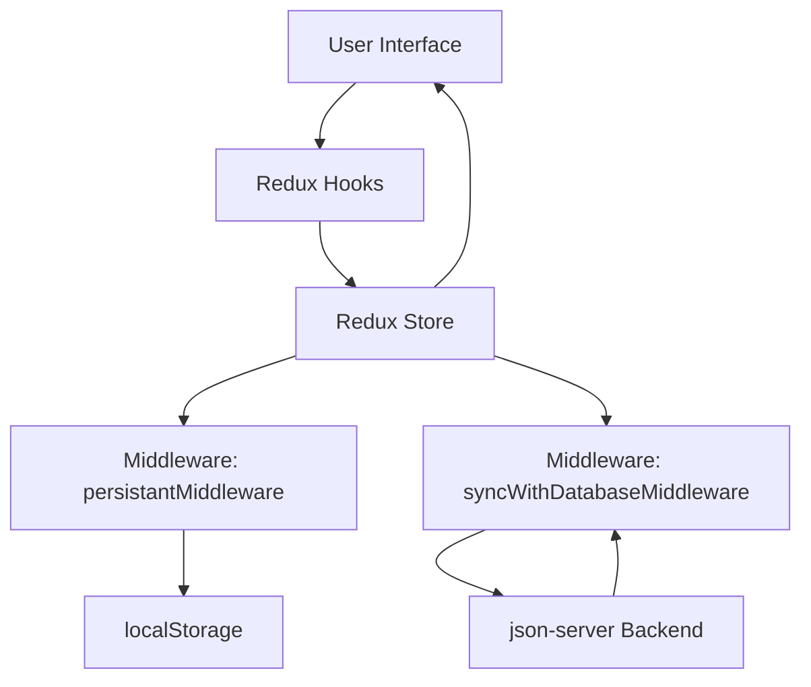

Perfecto 😎, aquí tienes tu **README completo en inglés**, actualizado para usar **Rome** en lugar de ESLint:

---

# 🗂 CRUD Redux Application

## 📌 Purpose and Scope

The **CRUD Redux Application** is a production-ready React app demonstrating enterprise-level patterns:

* **Centralized state management** with Redux Toolkit
* **Type safety** with TypeScript
* **Professional UI** using Material-UI components
* **Dual persistence strategies**: localStorage + **mock backend (json-server)**
* **Reusable hooks** for typed Redux integration
* **Full CRUD operations**: create, read, update, delete users

> 🔎 Related projects:
>
> * Simple state: Cat Facts Application
> * Reducer-based state: Translation Clone Application
> * Custom routing: alejhern_router

---

## 🏗 Application Architecture

| Layer            | Components                                           | Purpose                               |
| ---------------- | ---------------------------------------------------- | ------------------------------------- |
| Presentation     | `App`, `ModalUser`, `TableCell`                      | UI and user interaction               |
| State Management | Redux store, slices, custom hooks                    | Centralized state and action dispatch |
| Middleware       | `persistantMiddleware`, `syncWithDatabaseMiddleware` | Side effects and data synchronization |
| Persistence      | localStorage, json-server                            | Client and backend data storage       |

---

## 🚀 Entry Point and Bootstrap

```ts
const rootElement = document.getElementById('root')
createRoot(rootElement!).render(
  <StrictMode>
    <Provider store={store}>
      <App />
    </Provider>
  </StrictMode>
)
```

* **Root element:** `<div id="root"></div>`
* **Redux provider:** Wraps `<App />` for global state access
* **StrictMode:** Development-only checks
* **Global CSS:** Bootstrap imported for layout and styling

---

## 🛠 Redux Store Configuration

* **Reducer:** Single `users` slice managed by `usersReducer`
* **Middleware:** Default + `persistantMiddleware` + `syncWithDatabaseMiddleware`
* **Type exports:** `RootState` & `AppDispatch`

```ts
export type RootState = ReturnType<typeof store.getState>
export type AppDispatch = typeof store.dispatch
```

---

## 🔄 Middleware

### 1️⃣ Local Persistence (`persistantMiddleware`)

* Automatically syncs the users state to `localStorage`
* Triggered for actions with type starting `"users/"`
* Saves serialized state under the key `"users"`

### 2️⃣ Backend Sync (`syncWithDatabaseMiddleware`)

* Simulates a backend with **json-server**
* Intercepts actions with type `"users/*"`
* Calls `syncDB(type, payload)` → HTTP requests (`POST/PUT/DELETE`) to the local server

**Command to start json-server:**

```bash
npx json-server --watch db.json --port 3001
```

**`db.json` structure:**

```json
{
  "users": []
}
```

**Endpoints:**

| Method | Endpoint   | Action         |
| ------ | ---------- | -------------- |
| GET    | /users     | Get all users  |
| GET    | /users/:id | Get user by ID |
| POST   | /users     | Create user    |
| PUT    | /users/:id | Update user    |
| DELETE | /users/:id | Delete user    |

---

## 🖥 App Component Structure

* **Main container:** Material-UI `DataGrid` with users
* **Columns:** Avatar, ID, Name, Email, GitHub, Actions
* **Custom render:** Avatar image, Edit/Delete buttons

---

## 🔗 Custom Hooks

| Hook              | Purpose                        |
| ----------------- | ------------------------------ |
| `useAppSelector`  | Typed selector for Redux state |
| `useUsersActions` | Typed action creators for CRUD |
| `useModalUser`    | Modal state & form handlers    |

---

## 💾 Persistence Strategy

| Aspect       | localStorage   | Backend (json-server) |
| ------------ | -------------- | --------------------- |
| Speed        | Immediate      | Async                 |
| Offline      | Yes            | No                    |
| Data Sharing | Single browser | Multi-client          |
| Persistence  | Per-device     | Centralized           |

**CRUD + Persistence + json-server Flow:**



---

## 🎨 Styling

* **Global:** Bootstrap + `index.css` (dark/light theme)
* **Component:** `App.css` (max-width, centered, padding)
* **Material-UI:** `Paper`, `DataGrid`, Buttons, Icons

---

## ⚙ Rome & TypeScript

* **Rome** replaces ESLint, Prettier, and other linters/formatters.
* Centralized configuration is done via `rome.json`:

```jsonc
{
  "root": true,
  "compilerOptions": {
    "tsconfig": "./tsconfig.app.json"
  },
  "formatter": {},
  "linter": {
    "enabled": true
  }
}
```

* **Dual tsconfig** (optional if you want to separate application and tooling):

  * `tsconfig.app.json` → application
  * `tsconfig.node.json` → tooling (Vite, Rome tasks)

* **Redux Types:**

```ts
export type RootState = ReturnType<typeof store.getState>
export type AppDispatch = typeof store.dispatch
```

* Rome automatically checks **TypeScript types**, React hooks rules, and formats your code, so separate plugins like `@typescript-eslint` or `eslint-plugin-react-hooks` are not needed.

---

## 🏗 Development & Production Dependencies

### Dev

* vite, @vitejs/plugin-react(-swc), typescript, rome, json-server

### Prod

* @reduxjs/toolkit, react-redux, @mui/material, @mui/x-data-grid, bootstrap

---

## ✅ Summary

This application demonstrates:

* Scalable architecture with Redux Toolkit
* Middleware for dual persistence
* Type-safe hooks with TypeScript
* Professional UI with Material-UI
* Full CRUD operations synced with **localStorage** and **json-server**

---

Si quieres, puedo también hacer una **versión resumida y muy visual para GitHub**, usando badges de Rome y Redux, para que quede más profesional y fácil de leer.

¿Quieres que haga eso también?
